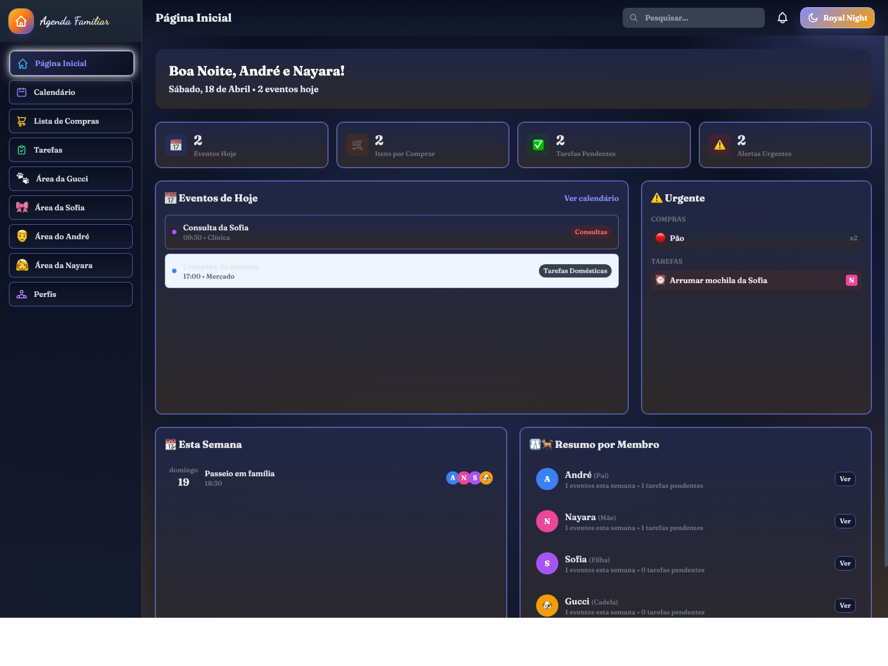
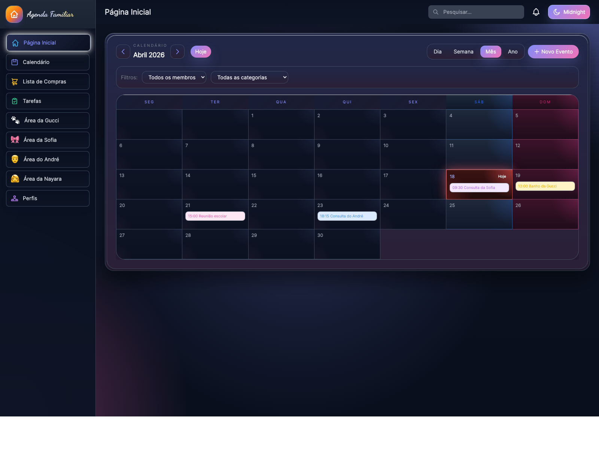
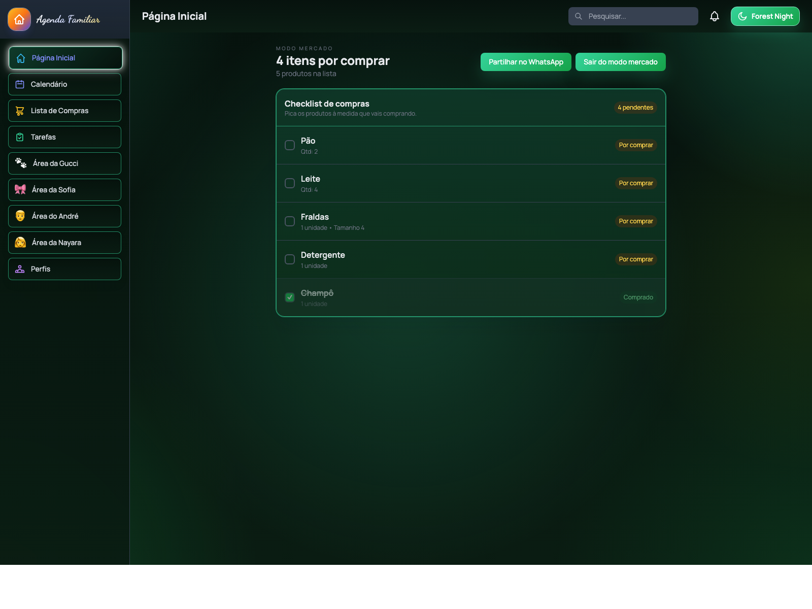

# Agenda Familiar

[](https://github.com/Barroso88/AgendaFamiliar/actions/workflows/deploy.yml)


Agenda Familiar é uma aplicação web premium para organizar a vida da casa num só sítio. Junta calendário, compras, tarefas e áreas personalizadas da família numa experiência visual mais elegante e rápida de usar.

## O que faz

- calendário com vistas `dia`, `semana`, `mês` e `ano`
- lista de compras com `Modo Mercado`
- tarefas e alertas pendentes
- áreas personalizadas para os membros da família
- área dedicada à Gucci
- área dedicada à Sofia
- armazenamento persistente num ficheiro JSON no Unraid quando corre em Docker

## Screenshots

Capturas reais da app em execução:





## Destaques

- temas visuais com forte diferenciação
- calendário com acabamento mais 3D
- lista de compras em checklist rápida
- registos de saúde e cuidados
- interface pensada para uso diário

## Roadmap

- melhorar a importação e exportação de dados
- adicionar mais filtros e pesquisa avançada
- guardar perfis e temas por utilizador
- criar notificações mais inteligentes
- adicionar sync opcional entre dispositivos
- preparar uma versão com autenticação

## Tecnologias

- HTML
- CSS
- JavaScript
- Tailwind via CDN

## Como correr

1. Abre o ficheiro `index.html` no browser.
2. Ou serve a pasta com um servidor simples local.

Exemplo:

```bash
python3 -m http.server 8000
```

Depois abre:

```text
http://localhost:8000
```

## GitHub Pages

O repositório está preparado para publicar em GitHub Pages através de GitHub Actions.

Se quiseres usar o próprio GitHub Pages, basta:

1. ir a `Settings > Pages`;
2. escolher `GitHub Actions` como source;
3. fazer `push` para a branch `main`.

## Domínio Próprio

Se quiseres publicar fora do GitHub ou usar um domínio personalizado, o fluxo é simples:

1. comprar ou apontar um domínio;
2. criar um registo `CNAME` no DNS para o domínio do GitHub Pages;
3. adicionar um ficheiro `CNAME` no repositório com o domínio final;
4. configurar o domínio em `Settings > Pages`.

Exemplo de domínio:

```text
agenda.exemplo.com
```

Nota: o ficheiro `CNAME` só deve ser criado quando o domínio final estiver definido.

## Estrutura

- `index.html` - estrutura principal da app
- `styles.css` - estilos personalizados
- `state.js` - estado, temas e utilitários
- `calendar.js` - calendário
- `shopping.js` - lista de compras
- `tasks.js` - tarefas
- `app.js` - renderizadores das páginas

## Dados

Em Docker no Unraid, os dados ficam guardados num ficheiro JSON no volume `/data`.
Se abrires a app como ficheiro local ou via GitHub Pages, a persistência cai de volta para `localStorage` no navegador.
